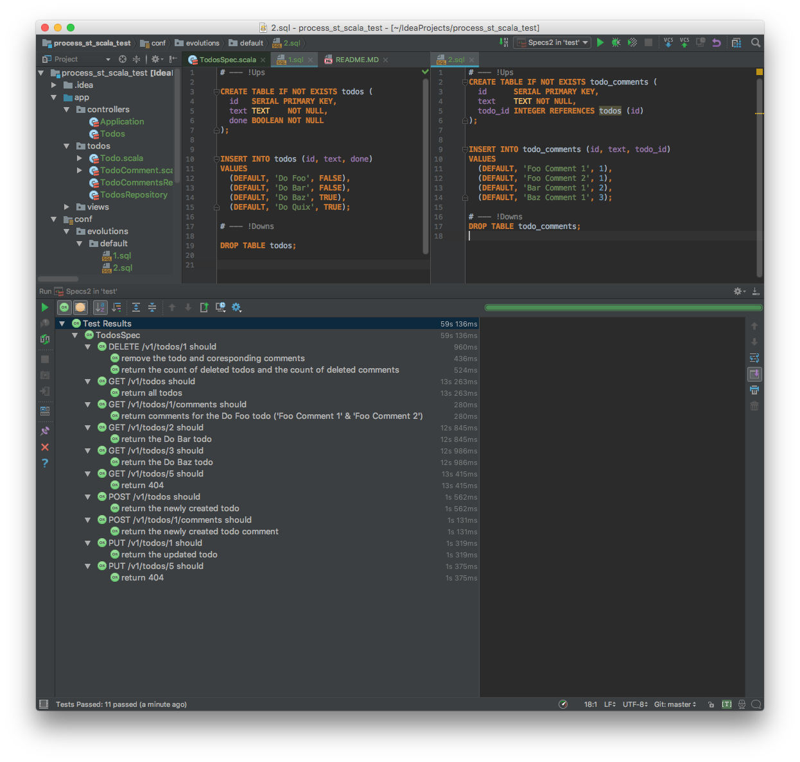

# Process Street Scala Technical Test

### Requirements

- It must use Play Scala 2.6.
- It must store its data in PostgreSQL using Anorm.
- It must allow me to create, edit, or delete todos.
- It must allow me to check/uncheck a todo.
- It must allow me to add comments to a todo.
- It must have unit tests.

### Notes

Spent nearly 20 hours including learning scala & play basics.

Wasted some time because I didn't realize that I'm using Play 2.5 in the 1st place.

Developed in TDD using API acceptance tests.

Of course, "Edit Todo" and "Check/Uncheck Todo" are both parts of the `UPDATE` method.

###### TODOs:

- Learn more about specific Play things like execution contexts, DI, mocks, etc and
    - write Unit tests
    - get rid of deprecated APIs
    - fix issues (see comments in code)
    - split repositories & controllers
- Encapsulate common things in more abstract classes & traits in order to make implementation classes more cohesive and readable
- Add/fix some REST methods in order to fully satisfy RESTful conventions
- Learn more abt modern Play best-practices and refactor accordingly
- Add the client-side app

### Tests Results

